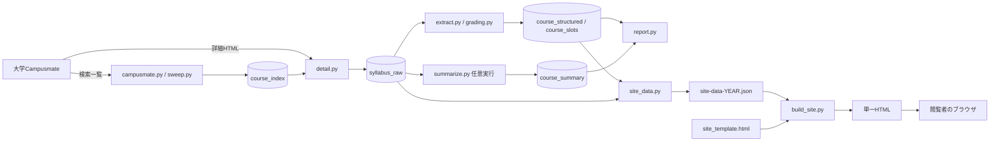

# 九大 授業さがし — 現行実装設計書

- 文書版: 1.0 / 2026-09-06
- 対象: レビュー修正版のPythonソース13本、site_template.html、実データ入り kyudai-courses-2026.html
- 目的: 別の開発者・AIが構造と挙動を把握し、コードと照合して追加レビューできるようにする。
- 性質: 現行コードから記述した実装設計書。理想仕様や品質保証書ではない。既知の制約・未検証事項は末尾に記載する。
- 配布済み画面のデザインは元実装を引き継いでいる。全面的なUI刷新は実施していない。

## 1. プロダクトの目的と範囲

九州大学のシラバスを収集・構造化し、学部、学年、開講期、科目区分、キャンパス、科目名・教員名などから授業を探す。時間割の曜日・時限を選ぶと、そのコマに該当する科目が表示される。科目詳細から公式シラバスに移動できる。

配布物はデータを埋め込んだ単一HTMLである。閲覧者にはPython、DB、サーバーが不要。EdgeやChromeでローカルファイルを開けば検索できる。インターネット接続は外部フォント取得や公式シラバスへの移動に使用する。検索条件は端末内で処理し、検索用APIへの送信は行わない。

履修登録、履修可否の保証、時間割の保存、お気に入り、ユーザー認証、ユーザー間共有状態、時間割PDFの解析、廃止科目の自動判定は実装していない。

### 現在配布しているデータ

| 項目 | 値・範囲 |
|---|---|
| 年度 | 2026年度 |
| コピーDBで再抽出した本文 | 4,111件 |
| 判定結果 | 学部2,190件 / 大学院1,638件 / 判定不能283件 |
| 配布HTMLの収録対象 | 学部と判定された2,190件 |
| 収集対象の中心 | 後期・秋学期・冬学期・通年系。全年度・全科目の網羅を意味しない |
| 出力サイズ | 約5.05 MBのHTML |
| 生成方法 | 取得済みDBを読み取り専用でコピーし、コピーに再抽出とHTML生成を実行 |
| 元DB | 生成前後のSHA-256が一致。元DBは変更していない |

本設計書の作成にあたって再クロールは行っていない。生成日、シラバス更新日、取得日は異なる概念である。

## 2. アーキテクチャ

収集・加工はPython、永続化はSQLite、閲覧はHTML/CSS/JavaScriptで構成する。フロントエンドのビルドツールや実行時フレームワークは使用しない。



**検索HTMLはcourse_summaryを参照しない。** 画面の授業概要は保存本文の所定セクションから抜粋しており、AI生成要約ではない。AI要約を生成しても、現行HTMLの概要には反映されない。

### モジュールの責務

| ファイル | 主な責務・入口 |
|---|---|
| config.py | 大学URL、大学ID、年度、DB/出力パス、学期・区分・学部表示の設定 |
| db.py | connect/init/session、DDL、列追加マイグレーション |
| campusmate.py | SearchSession、フォームPOST、件数・一覧行解析、ページ巡回 |
| sweep.py | run/store、検索条件ごとの一覧取得とcourse_index更新 |
| detail.py | run/fetch_one/extract_body、詳細取得、本文切り出し、ハッシュ差分 |
| extract.py | run/build_row/parse_sections、属性・フラグ・曜日時限の抽出 |
| grading.py | parse/total_pct、評価方法・割合・非実施・補足の解析 |
| summarize.py | targets/estimate/submit/collect、任意のAI要約処理 |
| report.py | report/export、実測レポートとCSV/JSON出力 |
| site_data.py | build、画面専用JSONの構築 |
| build_site.py | build、JSONをテンプレートへ埋め込んでHTML出力 |
| site_template.html | スタイル、操作UI、検索状態、一覧・時間割・詳細描画 |
| power.py | Windowsで収集中のスリープを抑止し終了時に解除。非Windowsは何もしない |
| run.py | CLI引数解析とジョブの順序制御 |

設定分離はあるが、各モジュールがKYUSHUを直接参照するため、完成した汎用マルチ大学アダプター基盤ではない。

## 3. コマンドと処理順序

| コマンド | 実行する処理 | 外部通信 |
|---|---|---|
| init | スキーマ作成・マイグレーション | なし |
| daily | sweep → 未取得detail → extract → site | 大学サイト |
| weekly | sweep → 全件detail → extract → site → changes(7日) | 大学サイト |
| full | sweep → 未取得detail → extract → report → export → site | 大学サイト |
| extract | 保存済み本文の年度単位の再抽出 | なし |
| report | 実測レポートとCSV/JSON生成 | なし |
| site | 構造化データと本文からJSON/HTML生成 | なし |
| changes | 指定期間の変更ログを集計 | なし |
| summarize | AI要約の対象抽出・送信・回収 | Anthropic API |
| summarize --dry-run | 件数と概算費用の見積もり | 対象があればトークン数確認API。0件なら通信なし |

主な引数は --year（既定2026）、--set（phase1/autumn/spring/full/all、既定phase1）、--workers（1〜5、既定4）、--all、--days（正の整数、既定14）。--set=fullは「通年系のみ」であり、ジョブfullとは意味が異なる。

--allはHTML・エクスポート・要約の学部限定を解除する。取得処理そのものは学部に限定しない。--setは今回の一覧検索条件であり、detailが読む対象はDBに既に存在するその年度の一覧全体である。

run.pyは共通引数を受け取るが、--dry-runで全ジョブを試行実行にできるわけではない。dry-runが有効なのはsummarize分岐のみ。

### 収集とエラー処理

- 一覧: エントリGETでセッションを開始。フォームのaction/timestampを取得し、buttonName=searchKougiでPOST。表示件数変更時はpageCountを空にする。既定200件/ページ、待機1秒。
- actionの送信先は同じnetlocかつHTTPSであることを検証する。HTTPクライアントはリダイレクトを追従する。リダイレクト先まで含む厳格な許可先制御は別途検討が必要。
- 件数が読めない応答はエラー。明示的な0件表現のみ空結果として認識する。ページ範囲・総件数・取得行数・重複・ページ進行を検証する。
- 一覧更新は条件単位でコミットする。1条件で失敗しても他条件を試し、最後にエラーがあれば例外で後続生成を止める。既存科目のkaiko_cdは追加蓄積する。
- 本文: 1〜5スレッド、既定4。各スレッドにhttpx.Clientを1本、タイムアウト120秒。1件につき最大3試行、再試行の待機はpause×2、pause×4。成功後も既定0.3秒待機する。
- DB書き込みは共有接続とロックで直列化。50処理ごとと通常終了時にコミットする。クライアントは実行終了時に閉じる。
- 通常の取得失敗は集計・記録・成功分コミット後に例外を投げる。予期しない例外・中断では最後の未コミット分をロールバックするが、crawl_runsの終了情報が埋まらないことがある。
- ジョブ全体が単一トランザクションではない。収集失敗後もDBに部分的な更新が残る。後続の自動生成は停止するが、利用者がsiteを単独実行することは禁止していない。

## 4. DB設計

SQLiteのWALモードを使用する。接続timeout=60秒、check_same_thread=False。session()は通常終了時コミット、例外時ロールバック、終了時closeを行うが、各処理の明示的なcommitが優先して確定する。

科目を表す論理キーKは `(university_id, year, course_code)`。SQLのJOINも原則この3列で照合する。**外部キー制約はDDLに存在しない。** 以下の関係はアプリケーションによる論理関係である。

| テーブル | キー・関係 | 主な列と目的 |
|---|---|---|
| universities | university_idがPK | name/base_url/adapter |
| course_index | KがPK | title/term_slots/instructors/kaiko_cd/first_seen/last_seen。検索一覧の現在値 |
| syllabus_raw | KがPK | body/updated_at/body_sha256/fetched_at/layout。最新の抽出本文 |
| course_structured | KがPK | 講義名、学部、学年、単位、学期、区分、評価、履修条件などの派生属性 |
| course_slots | PK・UNIQUEなし、Kに対し0〜複数行 | term/weekday/period/seq。複数の曜日時限 |
| course_summary | KがPK | summary/topics/model/prompt_version/source_sha256/generated_at |
| syllabus_change_log | idが連番PK | K、旧/新ハッシュ、旧/新更新日、kind、detected_at |
| crawl_runs | run_idが連番PK | job/started_at/ended_at/scope/件数/bytes/note |
| timetable_facts | PKなし。将来用途 | source/room/intensive_dates/match_status/raw_row等。現行の収集・画面経路では使わない |

course_structuredの属性は、numbering/title/subtitle、faculty/faculty_raw/department/title_suffix、target_grade/grades、credits/required/term/language/campus/instructors、is_undergrad/is_intensive/is_online、eval_exam/eval_report/eval_quiz/eval_attend/eval_other、prereq/keywords/goals/planに加え、マイグレーションでcategory/category_raw/term_groupを持つ。

### スキーマ変更・更新履歴

init()はCREATE TABLE IF NOT EXISTSの後、PRAGMA table_infoで不足列を確認し、ALTER TABLE ADD COLUMNを行う。スキーマバージョン表、列型変更、移行ロールバック機構はない。索引は学部・学部判定・曜日時限・科目キー・変更検出日時に設ける。

本文のUTF-8バイト列のSHA-256を計算する。初回はkind=new、ハッシュ変更かつ更新日変更ならupdated_at、ハッシュ変更のみならbody_only。更新日時文字列も本文に含まれるため、内容以外の更新日時差でもハッシュは変わり得る。

syllabus_rawは最新本文で上書きし、旧本文の全文は保存しない。変更ログから旧本文に復元することはできない。rawという名前だが保存するのは生HTMLではなく、タグ等を除いた本文である。

## 5. 本文と属性の抽出仕様

### 5.1 本文様式

HTMLからscript/style/commentを除去し、brやブロック終端を改行に変換、タグを除去、HTMLエンティティを復号、空白・連続改行を整理する。

| 様式 | 開始文字列 | 終了文字列 |
|---|---|---|
| A | 科目名称 | 合理的配慮について |
| B | 講義科目名 | PAGE TOP |
| C | 授業科目名 | PAGE TOP |

複数の開始文字列があるときは本文中で最も早い位置を採用する。終了文字列が見つからなければ末尾まで採用する。どの開始文字列もない場合は本文なしとして取得失敗にする。

parse_sectionsは様式ごとのラベルに行全体が一致するとセクションを切り替える。複数行ラベルの一部を事前に結合する。同一ラベルが複数回出た場合、setdefaultにより最初のセクションを残す。この方式は表のセル境界を完全に保持するものではない。

### 5.2 正規化・判定

| 項目 | 現行ルール |
|---|---|
| 学部名 | Aの学部カテゴリ、Bの開講学部・学府を優先。ない場合は対象学部等を使うため、学年文字列になる可能性もある |
| 学部判定 | 学府等の語→大学院、修士/博士等の対象学年→大学院、ナンバリング先頭レベル5以上→大学院・それ未満→学部、それ以外で学部/区分等に文字があれば学部、材料なし→NULL |
| 学科 | 講義名末尾の短い括弧内が既知略号の経経/経工に一致した場合。末尾括弧の原文は別列 |
| 学年 | 全角数字を半角化、入学年度を除外、1〜6を抽出、範囲を補完。未知・全学年は1〜4。『以上』も開始が4以下なら4まで、5以上なら6まで |
| 単位 | 最初に見つかる整数または小数をfloat化。不明はNULL |
| 区分 | 英語別名・和英併記の正規化→設定表による統合。経済学部は複合指定の先頭区分を採用。原文はcategory_rawに保存 |
| 少数区分 | その年度の学部科目で6件未満の非NULL区分を『その他』に統合 |
| 集中/遠隔 | 学期・曜日時限・遠隔授業・授業方法・区分の文字列を連結し、集中/オンライン等の語を検出。複雑な否定文の理解はしない |
| 曜日時限 | 『後期 月曜日 ２時限』などを(term, weekday, period)へ。全角時限数字を半角化。不一致行は『その他』として残す |

開講期のグループは前期、春学期、夏学期、後期、秋学期、冬学期、通年・その他。前期前半は春、前期後半は夏、後期前半は秋、後期後半は冬へ分類する。未知の学期は通年・その他になる。

extract.runは指定年度・大学のcourse_structured/course_slotsを削除し、その年度の保存本文全件から作り直す。他年度には触れない。rawに存在する限り、一覧から消えた科目も再抽出の対象になる。

### 5.3 成績評価

grading.parseは『定期試験、小テスト、レポート、発表、作品、授業への貢献度、出席、その他』を見出しとし、次の見出しまでを説明として読む。説明空欄または既知の非実施表現をunusedに分類する。

割合が説明中に1つだけあれば数値化し、2つ以上なら合算せずNULLと全文補足を残す。全行に割合がある場合のみ合計を返す。百分率の0〜100範囲や、欠席条件の割合と配点の意味の違いは検証しない。

評価フラグは半構造化欄なら実施行のラベルから作り、割合0の行は除外する。自由記述は句点等で分割し、非実施語を含む節を除いて語を検出する。小テスト・小試験・確認テストを試験へ重複加算しない。自由記述の一節に否定と肯定が混在する場合などは誤判定の余地がある。

### 5.4 画面の概要・授業計画

概要は優先順位付きのセクションから20文字以上の最初の値を採り、空白を整理して最大1,200文字に切り詰める。キーワードは120文字。

授業計画は全セクションから1〜2桁の数字だけの行が最も多いものを探し、2行以上あれば授業回の区切りとして扱う。テーマは120文字、内容は160文字まで。計画以外の連番表を誤採用する可能性がある。授業回数の正当性を保証する解析ではない。

## 6. 画面用JSONの契約

ルートは `{ "meta": {...}, "courses": [...] }`。文字列の欠損は多くの項目で空文字、数値の欠損はNULL、繰り返し項目は配列にする。JSONスキーマの独立ファイルや互換バージョンは設けていない。

metaはyear（整数）、undergrad_only（真偽）、generated_at（ローカル日時文字列）、n（件数）、faculties/campuses/term_groups（表示候補配列）、detail_url（{code}置換用）、category_other、grading_methodsを持つ。

| coursesのキー | 意味・型 |
|---|---|
| c / t / s | 科目コード / 講義名 / 講義題目。文字列 |
| f | 学部表示名。文字列 |
| g / grraw | 正規化学年の整数配列 / 対象学年原文 |
| cr / rq | 単位数numberまたはNULL / 必修選択文字列 |
| tm / tg | 開講学期原文 / 画面用グループ |
| cat / catr | 表示区分 / 表示区分と異なる場合の原文 |
| cp / ln | キャンパス / 使用言語 |
| i | 教員名の文字列配列 |
| sl | `[学期, 曜日, 時限]` の配列。各要素は文字列 |
| iv / ol | 集中・遠隔フラグ。通常0/1 |
| ev | `[試験, レポート, 小テスト, 出席・平常点]` の4フラグ |
| gr | `[方法名, 割合numberまたはNULL, 補足]` の配列 |
| gu / gx | 非実施の方法名配列 / 方法に紐づかない説明の配列 |
| gt | 全行の割合が判明する場合の合計number、それ以外NULL |
| ep | 評価の構造化行がない場合の原文、それ以外空文字 |
| pl | `[回数number, テーマ, 任意の内容]` の配列 |
| kw / d / n / u | キーワード / 概要 / ナンバリング / シラバス更新日(先頭10文字) |

site_dataはterm_groupをDBの保存値に依存せずtermから再計算する。HTMLには生成年度の対象科目を全件埋め込む。一覧表示上限を超えた科目もファイル内には含まれる。

## 7. UIと検索仕様

状態はterms（複数選択の集合）、fac、cat、grade、camp、text、cell、tray。状態の保存やURLへの反映はない。再読込で初期化される。

- 学部・区分・学年・キャンパス・テキストはAND条件。
- 学期は複数選択のOR条件。未選択は全学期。科目のtgに対して完全一致判定する。
- テキストは講義名・講義題目・教員・キーワード・コード・ナンバリングを連結し、小文字化した部分一致。空白区切りの複数語ANDや全半角正規化はない。入力から140ms後に反映する。
- 区分候補と件数は選択学部のみを反映する。学年・学期・テキストなどの他条件は反映しない。
- 時間割は月〜金、データに土日があれば追加。時限は1〜9の1桁だけを配置し、最低5限まで表示する。同一科目・同一セルの重複は除く。
- 有効セルに一度も配置できない科目は『集中講義ほか』へ入れる。集中フラグそのものによる分類ではない。
- 現行では科目をtgで絞った後、その科目のsl全体をセルに配置する。sl各行の学期で再フィルタしない。複数学期で曜日が変わる科目は重点レビュー対象。
- 一覧は学部の設定順位→科目コードの順で最大300件を描画。ページ送りはなく、上限超過時は絞り込みを案内する。未知の学部同士の一覧順はコードに依存する。
- セルを選ぶとそのコマの一覧、集中講義ほかを選ぶと未配置科目の一覧になる。学期変更時はcellを解除するが、他条件変更時の解除ルールは一律ではない。
- 講義名を押すとその行の詳細を開閉する。複数の詳細を同時に開ける。再描画時は開閉状態を保持しない。
- 授業計画は先頭5回を表示し、残りを展開可能。成績評価は表・割合バー・補足・非実施項目を表示する。
- 画面幅に応じてパネル配置を変更する。狭い画面では時間割を横スクロールする。リサイズイベント登録は1回、検索解除時は待機中のタイマーを消す。

## 8. AI要約とエクスポート

AI要約は通常のfull/daily/weeklyには含まれない。モデルIDはソース定数claude-opus-5、プロンプト版v2、max_tokens=2000。これはコードの設定値であり、APIの利用可能性・最新料金を保証する記述ではない。

対象は要約なし、本文ハッシュ不一致、プロンプト版不一致、モデル不一致のいずれか。NULLも差分と判定する。1バッチ1,000件で送信し、30秒ごとに終了を確認する。完了期限の上限はない。

期待するJSONはsummary:string、topics:string[]。120〜200字・5〜10トピックはプロンプト上の希望で、回収時の字数・配列長チェックはない。API結果がsucceeded、stop_reason=end_turn、既知のID、JSONと型が妥当な場合に保存する。ローカル検証では追加キーの拒否はしていない。

バッチID・投入時ハッシュはメモリとコンソールにあり、自動再開用の永続ジョブ管理はない。回収で数えた個別エラーは件数として返されるが、run.pyはそれを終了コードに変換していない。

見積もりは先頭20件の入力トークン平均、出力400トークン仮定、コード内の単価から算出する。モデルの実利用や見積もりの妥当性は別途確認が必要。

CSV/JSONには科目属性と、本文ハッシュの一致するAI要約を出力する。ここではプロンプト版・モデルの一致までは要求しない。CSVはUTF-8 BOM付き、0件でも列名付き。先頭が数式開始文字等の文字列にはアポストロフィを付け、JSON側は原文を維持する。

## 9. 配布・配置・再生成

既定DBは `Path.home()/syllabus-db/kyudai.db`、出力はソース配下exports。実行前の環境変数SYLLABUS_DB_PATH、SYLLABUS_EXPORT_DIRで変更できる。Python 3.10以上を想定し、requirements.txtはhttpx、requirements-ai.txtは任意のanthropic SDKを指定する。

```powershell
python -m pip install -r requirements.txt
# 設定先のDBを初期化・更新する。既存DBは先にバックアップする。
python run.py init
# 本文取得済みDBがある場合は通信なしで再生成できる。
python run.py extract --year 2026
python run.py site --year 2026
# 全科目版を生成する場合。
python run.py site --year 2026 --all
```

siteコマンドだけでは構造化データの再抽出を行わない。既存本文に抽出修正を適用するにはextract→siteが必要。空DBでsiteを実行しても0件のHTMLが生成される。

出力名はsite-data-YEAR.json、kyudai-courses-YEAR.html。学部限定版と--all版は同じ名前で上書きされる。JSON/HTMLは直接書き込みであり、一時ファイルからの原子的置換ではない。閲覧中の配信ディレクトリへ直接再生成する運用には改善余地がある。

配布HTMLはSlack等でファイルとして渡せる。ZIPは展開後にHTMLを開く。`127.0.0.1`のプレビューURLはそのPC専用で、他の利用者からはアクセスできない。一般公開用のホスティングや認証・アクセス制限は本実装に含まれない。

追加レビュー一式の構成:

```text
DESIGN.md                         本設計書
REVIEW_REQUEST.md                 追加レビューに渡す依頼文
source/syllabus-db/               修正版ソース・既存README/REVIEW・テスト
app/kyudai-courses-2026.html       実データ入り配布HTML
app/使い方.txt                    閲覧者向け手順
SHA256SUMS.txt                    同梱ファイルの照合用ハッシュ
```

DB本体・APIキー・端末固有の生成補助スクリプト・プレビューサーバーは同梱しない。HTMLのブラウザ検証とテストの一時DBは利用できるが、実データ全件のPython再抽出には別途保存本文DBが必要。

## 10. セキュリティと信頼境界

大学HTML、保存本文、AI応答は外部由来データとして扱う。SQL値はパラメータ渡し、動的SQLの列名等はコード定数から組み立てる。

HTML表示ではescで&/< />/二重引用符をエスケープする。JSONをscriptタグ内へ挿入する前に&/< />をUnicodeエスケープする。コードは公式リンクでencodeURIComponentし、リンク全体も属性用にエスケープする。target=_blankのリンクにrel=noopenerを付ける。

HTMLはデータ全体を含むため、画面上のフィルタはアクセス制御ではない。閲覧者はファイル内の全収録データを読める。APIキー・SQLite・取得時CookieはHTMLに埋め込まない。

AIプロンプトには本文内の指示に従わない旨を記載しているが、これだけでプロンプトインジェクション耐性を保証しない。AI出力も検証対象である。

## 11. 検証の実績と未検証範囲

実施済み:

- unittest 26件: 模擬ページング、0件、件数不整合、重複、取得エラー、抽出とロールバック、マイグレーション、年度共存、評価、要約差分・型検証、CSV/JSON/HTMLを確認。
- CLI: 一時DBでinit/extract/report/site/changes、要約対象0件のdry-run、無効引数の拒否。
- 架空データのEdge検証: 別年度/--all、土曜列、学期選択、詳細、検索解除、resize登録数、特殊文字、JavaScriptエラーなし。
- 後続の実データ生成: 4,111件を再抽出、2,190件をHTML化。経済学部98件への絞り込みと『統計』検索5件、詳細・公式URLを確認。1440px/390pxで操作確認、JavaScriptエラー0件。
- 元DBの生成前後ハッシュ一致。

```powershell
# source/syllabus-db ディレクトリで実行
python -X utf8 -m unittest discover -s tests -v
```

同梱のbrowser_checks.cjsは架空の2027年度データ専用。2026年度の実データHTMLをそのまま渡すテストではない。生成・実行手順はsource/syllabus-db/README.mdを参照。

未実施: 修正版による実サイト再クロール、全4,111科目の原文照合、実AIバッチ送信/回収、停止・並行更新・ディスク不足などの障害注入、iOS/Safari/Android実機、公開環境での負荷・配信設定。従来README/REVIEWの記録と、後続で追加した実データ検証を区別する。

## 12. 追加レビューの重点項目

以下は現行コードから確認できる制約または検証候補であり、この文書作成ではコード修正していない。重要度は追加レビューで再評価する。

| 論点 | 主な参照先 | 確認してほしいこと |
|---|---|---|
| 学期と曜日時限の整合 | site_template.html passes/render、site_data.py | 科目tgだけの選択で別学期のslを表示しないか。通年・前後期を含む検索の利用者期待と一致するか |
| 未知・否定・条件付き属性 | extract.py undergrad_flag/grades_of/eval_flags、grading.py | 非実施と配点、6年制、大学院、英語表記、混在文の誤判定。NULLと0の意味の整理 |
| 原文の切り出し精度 | detail.py extract_body、extract.py parse_sections | ラベルが本文にも出るケース、終了マーカー欠落、重複見出し、HTML表の壊れ方 |
| 授業計画の誤認 | site_data.py plan_of | 計画以外の連番・到達目標・評価表を授業回として採用しないか |
| 廃止・非開講の扱い | sweep.py store、extract.py run | last_seenの活用、kaiko_cdの追加蓄積、一覧から消えた科目の表示継続 |
| 失敗・整合性・同時実行 | detail.py/sweep.py/db.py | 中断時のrun記録、部分コミット、二重ジョブ、ロック、再実行時の変化ログ重複 |
| 成果物の上書き | build_site.py/site_data.py | 学部版と全科目版の衝突、JSONとHTMLの世代一致、書き込み途中の配信 |
| AI要約の運用 | summarize.py | バッチ永続化・再開、送信成功後の中断、再課金、回収漏れ・個別失敗の終了コード、モデル/価格・SDKの実確認 |
| 識別と制約 | db.py | 外部キーなし、slotsのUNIQUEなし、crawl_runsの大学/年度列なし。誤混入を検出できるか |
| UIとアクセシビリティ | site_template.html | 300件上限、詳細開閉状態、空集合時の操作、フォーカス、読み上げ、色コントラスト、実機表示 |
| 信頼境界・共有 | campusmate.py/report.py/build_site.py | リダイレクト、CSV数式、全HTML挿入箇所、配布データ範囲、外部フォント、ファイル共有時の挙動 |
| 再現性 | requirements*.txt/tests | 依存関係固定、実サイト由来の匿名化fixture、別OS/Python、更新後の実データ比較 |

追加レビュー結果には、ファイル・関数、再現入力、期待/実際の結果、影響、修正案、追加テストを含めると対応しやすい。設計書とコードが違う場合は差異を明示し、実装済みの保証と改善提案を混同しない。
